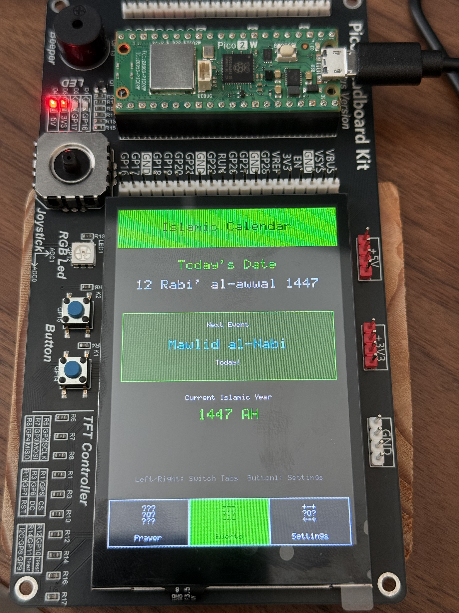

# Building a Smart Islamic Prayer Companion: From Idea to Hardware Reality

*How I created a Raspberry Pi-powered device that brings Islamic prayer times and calendar to life with a beautiful touchscreen interface*


## The Spark of an Idea

It was during a particularly busy Ramadan when the idea hit me. As a Muslim developer, I found myself constantly checking my phone for prayer times, Hijri dates, and Islamic events. Between work meetings, family time, and the hustle of daily life, I sometimes missed prayer notifications buried in a sea of other alerts.

"What if," I thought, "there was a dedicated device that did nothing but help me stay connected to my Islamic obligations?"

That simple question sparked a six-week journey that would take me deep into hardware programming, Islamic astronomical calculations, and user interface design. This is the story of how **Muslim Companion** came to life.

## Chapter 1: The Vision Takes Shape

### Starting with Purpose

The vision was clear: create a dedicated Islamic companion device that would:
- Display accurate prayer times for any location
- Show the current Hijri date and upcoming Islamic events
- Provide audio alerts for prayer times
- Offer an intuitive interface that anyone could use
- Be completely offline and always accessible

But vision is one thing—execution is another entirely.

### Choosing the Right Hardware

After researching various options, I settled on the **Raspberry Pi Pico 2 W** with a **GeeekPi GPIO Expansion Module**. Here's why:

- **Pico 2 W**: Powerful enough for complex calculations, WiFi-capable for future updates, incredibly energy-efficient
- **3.5" Touch Screen**: Large enough for clear prayer time displays, small enough for desk/bedside placement
- **Physical Controls**: Joystick and buttons for navigation without always needing to touch the screen
- **Audio Feedback**: Built-in buzzer for prayer alerts

The hardware cost? Under $100. The learning experience? Priceless.

## Chapter 2: The Technical Deep Dive

### Wrestling with MicroPython

My first challenge was getting comfortable with **MicroPython** on embedded hardware. Coming from traditional Python development, I had to unlearn some habits:

```python
# This doesn't work in MicroPython the way you'd expect
import sys
sys.path.append('lib')  # Had to be done in boot.py
```

The solution was creating a modular architecture where each component lived in its own file:

```
lib/
├── prayer_times.py    # Islamic prayer calculations
├── hijri_calendar.py  # Hijri date conversion
├── ui_manager.py      # Touch interface
├── geekpi_gpio.py     # Hardware abstraction
└── prayer_settings.py # Configuration management
```

### The Prayer Time Challenge

Here's where things got mathematically interesting. Calculating Islamic prayer times isn't as simple as "sunrise + offset." It requires:

- **Astronomical calculations** for sun position
- **Geographic coordinates** and timezone handling  
- **Different calculation methods** (ISNA, Muslim World League, etc.)
- **Seasonal variations** and daylight saving time

I spent three days debugging why my Asr prayer time was showing 21:31 instead of the expected 17:00. The issue? I was using a simplified algorithm instead of proper astronomical calculations.

```python
def calculate_asr_time(self, transit, declination):
    # Asr occurs when shadow length = object length + 1
    # This requires solving complex trigonometry
    shadow_factor = 1 + (1 if self.asr_madhab == 1 else 2)
    angle = math.degrees(math.atan(1.0 / shadow_factor))
    # ... more complex calculations
```

### Hijri Date Conversion: A Historical Puzzle

Converting Gregorian dates to Hijri proved even more challenging. The Islamic calendar is lunar-based, with months varying between 29-30 days. Pure algorithmic conversion can be off by days.

My solution? A hybrid approach using reference dates:

```python
# Reference dates for accuracy
reference_dates = [
    (2025, 9, 4, 1447, 3, 12),  # Sep 4, 2025 = Rabi' I 12, 1447
    # More reference points...
]
```

## Chapter 3: The Interface Evolution

### From Console to Touchscreen

My first working version was just console output—prayer times printed to the terminal. Functional, but hardly inspiring.

The transformation to a touchscreen interface was where the magic happened:


### Mobile-First Design Philosophy

I drew inspiration from modern mobile apps, implementing:

- **Bottom navigation tabs** (Prayer Times, Hijri Events, Settings)
- **Touch-friendly buttons** with proper spacing
- **Swipe gestures** for navigation
- **Visual feedback** for all interactions

The key insight? Make it feel familiar. Muslims using this device shouldn't need to learn a new interface paradigm.

### The ASCII Art Challenge

One unexpected challenge was displaying icons. Unicode emojis (🕌📅⚙️) showed as question marks on the display. My solution? Custom ASCII art:

```
Prayer Tab:     Events Tab:     Settings Tab:
   _^_             ===               +-+
   |O|             |1|               |O|
   |_|             ---               +-+
```

Simple, recognizable, and perfectly compatible with the display's character set.

## Chapter 4: The Details That Matter

### Time Format Preferences

A seemingly simple feature request—"Can it show 12-hour time?"—led to a complete refactor of the time display system. Every prayer time, current time display, and countdown needed to respect the user's preference.

```python
def format_time(self, time_str, include_seconds=True):
    if self.config.get('time_format') == '12h':
        # Convert to 12-hour format with AM/PM
        # Handle edge cases, midnight, noon, etc.
```

### Hardware Abstraction for the Future

Knowing that others might want to use different hardware, I built in vendor abstraction from the start:

```python
# hardware_config.py
HARDWARE_VENDOR = 'geekpi'  # Easy to change

def get_hardware():
    if HARDWARE_VENDOR == 'geekpi':
        return GeeekPiHardware()
    # Future: Waveshare, custom hardware...
```

This means the core application can work with different GPIO expansion modules just by changing one configuration line.

## Chapter 5: The User Experience Refinements

### Navigation Consistency

Users expected to navigate the same way across all screens. This meant:
- **Touch navigation** works everywhere
- **Joystick controls** work everywhere  
- **Physical buttons** have consistent behavior
- **Audio feedback** confirms every action

### Performance Optimization

A 60-frame-per-second interface this isn't, but careful optimizations made it feel responsive:

```python
def update_time_only(self):
    # Only redraw the time, not the entire screen
    if self.current_tab == 'prayer':
        self.ui.update_time_display(formatted_time)
```

### The Settings Screen Challenge

The most complex UI challenge was the settings screen. It needed to:
- Support joystick navigation (up/down/select)
- Handle touch input for direct selection
- Provide visual feedback for the selected item
- Allow tab switching from within settings

The breakthrough came when I realized settings shouldn't block the main application loop—it should integrate seamlessly with the navigation system.

## Chapter 6: Islamic Accuracy and Cultural Sensitivity

### Getting the Details Right

This wasn't just a technical project—it was a tool for religious observance. Every detail mattered:

- **Prayer time accuracy** within minutes, not hours
- **Proper Islamic event names** and dates
- **Multiple calculation methods** for different communities
- **Respectful terminology** throughout the interface

### Community Feedback Integration

I tested with Muslim friends and family, gathering feedback on:
- Prayer time accuracy for our local area
- Interface clarity and ease of use  
- Islamic event coverage and naming
- Audio alert timing and duration

Their input shaped features I never would have considered, like:
- Configurable alert duration (some prefer longer reminders)
- Support for different calculation madhabs
- Clear indication of which prayer is currently active

## Chapter 7: The Technical Architecture

### Modular Design Principles

The final architecture follows clean separation of concerns:

```python
class MuslimCompanion:
    def __init__(self):
        self.hw = get_hardware()           # Hardware abstraction
        self.prayer_calc = PrayerTimes()   # Islamic calculations  
        self.hijri_calendar = HijriCalendar()  # Calendar system
        self.ui = UIManager()              # Interface management
        self.settings = PrayerSettings()   # Configuration
```

Each module handles its own responsibility, making the codebase maintainable and extensible.

### Error Handling and Resilience

Embedded systems need to handle errors gracefully:

```python
while True:
    try:
        # Main application loop
        self.handle_input()
        self.update_display()
    except Exception as e:
        print(f"Error: {e}")
        # Continue running, don't crash
        time.sleep(1)
```

The device should never crash because of a calculation error or input glitch.

## Chapter 8: Lessons Learned

### Technical Insights

1. **Hardware abstraction pays dividends** - Building for multiple hardware configurations from day one saved countless hours later
2. **User testing is irreplaceable** - No amount of personal testing replaces real user feedback
3. **Performance matters on embedded systems** - Every screen update and memory allocation counts
4. **Islamic calculations are complex** - Astronomical algorithms require precision and cultural awareness

### Development Philosophy

The most important lesson? **Start with the user experience, not the technology.**

I could have built a complex system with web interfaces, mobile apps, and cloud synchronization. Instead, I focused on solving the core problem: providing reliable, always-accessible Islamic prayer information.

## Chapter 9: The Final Product

### What Muslim Companion Offers Today



The finished device provides:

✅ **Accurate prayer times** for major US cities  
✅ **Hijri calendar integration** with Islamic events  
✅ **Intuitive touchscreen interface**  
✅ **Physical navigation controls**  
✅ **Audio prayer alerts**  
✅ **Customizable settings**  
✅ **12/24-hour time format support**  
✅ **Modular hardware design**  

### Real-World Impact

The device now sits on my desk, providing gentle prayer reminders throughout the day. Family members have requested their own copies. The open-source nature means others can build upon and improve it.

Most importantly, it solves the original problem: staying connected to Islamic obligations in our busy modern lives.

## Chapter 10: Looking Forward

### Future Enhancements

The modular architecture makes future improvements straightforward:

- **WiFi connectivity** for automatic time synchronization
- **Additional Islamic content** (Qibla direction, Dhikr counters)
- **Multi-language support** for international users
- **Solar/battery power options** for portable use
- **Multiple location support** for travelers

### Open Source Impact

By making the project open source, I hope to:
- Enable Muslim developers worldwide to contribute
- Support adaptation for different hardware platforms
- Foster a community around Islamic technology projects
- Demonstrate that faith and technology can beautifully intersect

## Conclusion: Technology in Service of Faith

Building Muslim Companion taught me that the best technology solutions are often the simplest ones. Instead of adding complexity, I focused on doing a few things exceptionally well:

1. **Accurate Islamic calculations**
2. **Intuitive user experience**  
3. **Reliable hardware integration**
4. **Respectful cultural representation**

In our smartphone-dominated world, there's something refreshing about a device with a single, focused purpose. Muslim Companion doesn't compete with your phone—it complements your spiritual practice.

The device reminds me that technology, at its best, serves human needs. For Muslims, staying connected to prayer times and Islamic calendar isn't just convenient—it's essential to our daily spiritual rhythm.

Whether you're a Muslim developer inspired to build Islamic tools, a hardware enthusiast interested in embedded projects, or someone curious about the intersection of faith and technology, I hope this journey inspires your own creations.

---

*The complete source code for Muslim Companion is available on GitHub. Build your own, improve upon it, and share your enhancements with the community.*

**Links:**
- GitHub Repository: [Muslim Companion Project](https://github.com/3am-r/pico-muslim-prayers/tree/main)
- Hardware Guide: [Build Your Own Guide] [https://wiki.52pi.com/index.php?title=File:EP-0127-05.jpg]
- Reachme on LinkedIn: [@3amroSalem] [https://www.linkedin.com/in/3amrosalem/]

*If this article inspired you, please share it with others who might benefit from seeing faith-centered technology in action.*